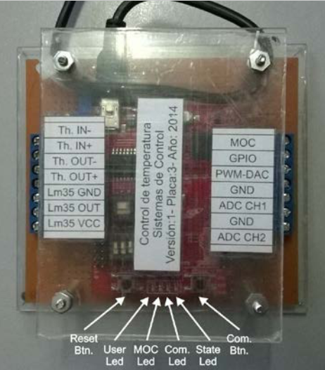
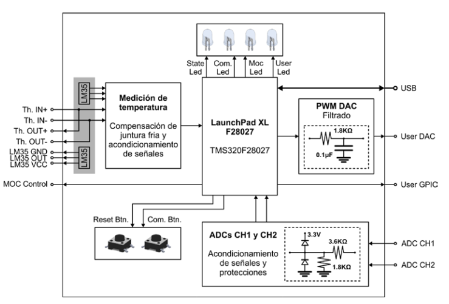
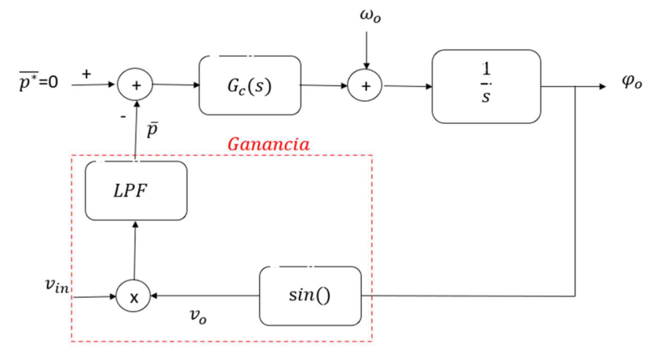
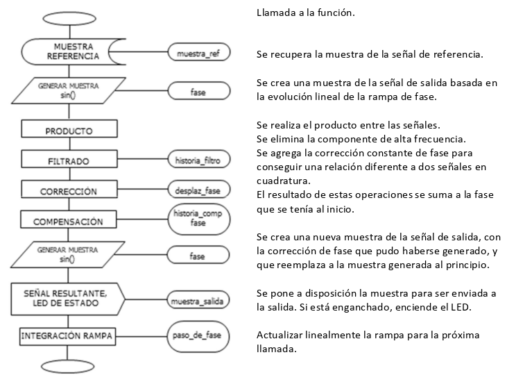

# Digital-PLL-Frequency-Synthesizer---Phase-Synchronization-Discrete-Time-Control-TI-F28027

## Introduction

A Phase-Locked Loop (PLL) is a feedback control system used to synchronize the phase and frequency of a generated signal with a reference signal.

PLLs are fundamental building blocks in modern electronic systems because they allow a system to generate, track and synchronize precise frequencies starting from a reference clock or signal.

They are widely used in applications such as:

Frequency synthesizers: generation of stable and precise frequencies for wireless communication systems, RF transceivers, mobile devices, routers and other digital communication equipment.
Signal demodulation: recovery of frequency and phase information in communication receivers.
Clock generation and synchronization: generation and synchronization of system clocks in digital electronics and high-speed communication systems.
Motor speed control: synchronization and regulation of rotational speed using a precise frequency reference.
Power systems: synchronization of electrical generators and power electronic converters with the grid phase.
Data communication systems: clock and carrier synchronization in digital communication architectures.

This project focuses on the implementation of a digital multiplier PLL, where phase error is obtained from the multiplication of the reference signal and the generated signal. The resulting signal is filtered, compensated and used to correct the phase evolution of the synthesized waveform.

The design was implemented in C on a Texas Instruments LaunchPad XL F28027, transforming the mathematical PLL model into a real-time embedded implementation.

Hardware setup:

Block diagram:

## Project Overview

The objective of the project was to design and implement a 50 Hz sinusoidal signal synchronized with a 50 Hz reference signal, while maintaining phase synchronization under changes in the input signal.

The implementation follows a digital PLL architecture consisting of:

The architecture combines concepts from:

- Digital Signal Processing
- Feedback Control
- Discrete-Time Systems
- Frequency Synthesis
- Phase Synchronization
- Embedded C Programming

## Hardware Platform

### Development Board

Texas Instruments LaunchPad XL F28027
TI C2000 microcontroller family
Real-time embedded execution
ADC-based reference signal acquisition
Digital generation of the synchronized output waveform

The algorithm was designed to operate in real time, with the main PLL function executed every 1 ms.

## How the Digital PLL Works

The generated sinusoidal signal is multiplied by the reference signal.

According to the trigonometric product relationship, the multiplication generates:

A high-frequency component.
A low-frequency component containing information related to the phase difference between the two signals.

The high-frequency component is removed using a low-pass filter. The remaining component is used as an estimate of the phase error.

The phase error is then processed by the compensator, which modifies the phase evolution of the synthesized signal until synchronization is achieved.

## Control and Stability Design

One of the most important aspects of this project was not only implementing the PLL algorithm, but designing its control loop for stable operation.

The initial model without compensation presents an unstable behavior due to the double pole at the origin.

To solve this, the loop was redesigned using loop-shaping techniques, introducing:

Additional gain.
A compensator zero to provide phase lead.
An integrator required to obtain a type-2 system.
Frequency-domain analysis of the open-loop transfer function.

The compensated continuous-time model was designed for a phase margin of approximately 45°.

The analysis also predicted a compensated bandwidth of approximately:

25 rad/s

This part of the project is particularly relevant because it connects classical control theory with a practical digital implementation.

## Digital Filter and Compensator

After the continuous-time design, the filter and compensator were transformed to the discrete-time domain for implementation in the microcontroller.

The discrete filter obtained from the design was:

Gf(z) =
0.0618551 z⁻¹
----------------------
1 - 0.9690724 z⁻¹

with the corresponding difference equation:

yf(k) =
0.0618551 xf(k-1)
+
0.9690724 yf(k-1)

The compensator was implemented as:

Gc(z) =
-63.4619772 z⁻¹ + 63.6619772
--------------------------------
1 - z⁻¹

with the corresponding difference equation:

yc(k) =
63.6619772 xc(k)
-
63.4619772 xc(k-1)
+
yc(k-1)

This allowed the continuous-time control design to be translated into a real-time discrete implementation.

## Real-Time Algorithm

The complete PLL algorithm runs every 1 ms.

At each execution:

The reference sample is acquired.
The current synthesized sinusoidal sample is generated.
The reference and generated signals are multiplied.
The high-frequency component is removed by the digital filter.
The phase error is calculated.
The compensator calculates the required correction.
The current phase is updated.
A corrected sinusoidal sample is generated.
The phase accumulator is updated for the next iteration.
The synchronization state is monitored.

This creates a discrete-time feedback loop running directly on the microcontroller.

## Phase Synthesis

The output waveform is generated using a phase accumulator.

The nominal phase increment is:

Δφ = 2π / 20

which corresponds to 20 samples per period with a 1 ms sampling interval:

Ts = 1 ms
Fs = 1 kHz

fout = 50 Hz

The synthesized waveform is then obtained from:

sin(phase)

The PLL correction modifies the phase trajectory before the next output sample is generated.

## Embedded C Implementation

The complete algorithm was implemented in ANSI C, with the PLL processing contained in a single function executed periodically.

The implementation maintains the internal state of:

Previous filter input/output.
Previous phase error.
Previous compensator output.
Phase accumulator.
Frequency/phase correction.

This makes the implementation suitable for real-time execution and demonstrates the translation of a control-system model into embedded software.

## Why This Project Matters

The main value of this project is not simply generating a 50 Hz sine wave.

The important engineering challenge was to take a continuous-time control model, analyze its stability, design the required compensation, transform the system into a discrete-time implementation, and finally execute the resulting algorithm in real time on embedded hardware.

#Technologies
- C / ANSI C
- Digital Signal Processing
- Discrete-Time Control
- PLL
- Frequency Synthesis
- Phase Synchronization
- Scilab
- Texas Instruments C2000
- LaunchPad XL F28027
